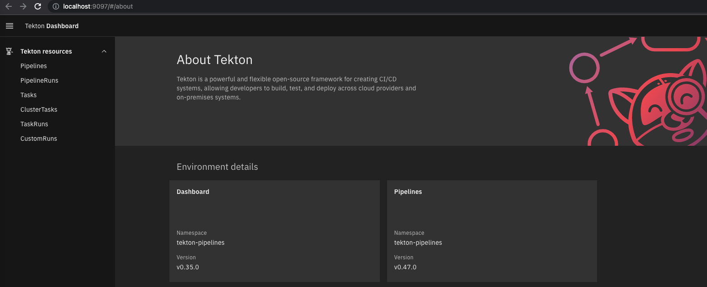
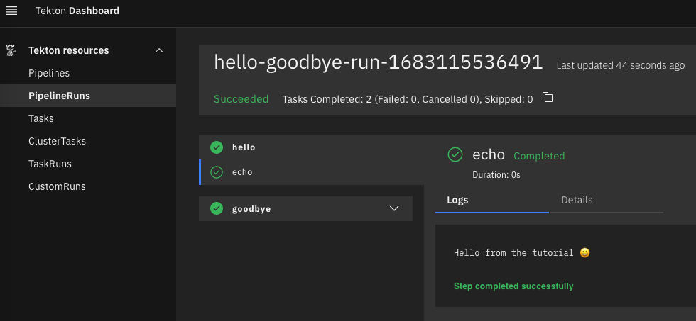

# TEKTON FIRST DEMO (TEKTON DASHBOARD)


## Instructions

Spin up a local `minikube` cluster:
```console
minikube start --profile tekton-dashboard-tutorial
```

Install `tekton pipelines` on your cluster
```console
kubectl apply -f https://storage.googleapis.com/tekton-releases/pipeline/latest/release.yaml
```

Install `tekton dashboard` on your cluster
```console
kubectl apply -f https://storage.googleapis.com/tekton-releases/dashboard/latest/release-full.yaml
```

Monitor tekton installation:
```console
kubectl get pods --namespace tekton-pipelines --watch
```

Now retrieve tekton dashboard service port:
```console
kubectl get svc tekton-dashboard -n tekton-pipelines

NAME               TYPE        CLUSTER-IP       EXTERNAL-IP   PORT(S)    AGE
tekton-dashboard   ClusterIP   10.105.171.239   <none>        9097/TCP   97s
```

We need to port forward the dashboard service on the discivered port:
```console
kubectl port-forward -n tekton-pipelines service/tekton-dashboard 9097:9097
```

Now we can reach the dashboard via browser at the following url:
<br/>
http://localhost:9097

<p float="left">
  
</p>


## Grant required permissions

The import must be executed using a ServiceAccount with permissions to create the resources being imported.

For this tutorial we will create a ClusterRole granting permission to create a number of Tekton resources, and a RoleBinding configuring this so that the `default` ServiceAccount in the `tekton-dashboard` namespace can create resources in the `default` namespace.

Run the following command in a new terminal:
```bash
kubectl apply -f - <<EOF
apiVersion: rbac.authorization.k8s.io/v1
kind: ClusterRole
metadata:
  name: tekton-dashboard-tutorial
rules:
  - apiGroups:
      - tekton.dev
    resources:
      - tasks
      - taskruns
      - pipelines
      - pipelineruns
    verbs:
      - get
      - create
      - update
      - patch
---
apiVersion: rbac.authorization.k8s.io/v1
kind: RoleBinding
metadata:
  name: tekton-dashboard-tutorial
  namespace: default
roleRef:
  apiGroup: rbac.authorization.k8s.io
  kind: ClusterRole
  name: tekton-dashboard-tutorial
subjects:
  - kind: ServiceAccount
    name: default
    namespace: tekton-dashboard
EOF
```

## Import some Tekton resources using the Tekton Dashboard

We will import [two simple Tasks and a Pipeline definition](https://github.com/tektoncd/dashboard/tree/main/docs/tutorial) to demonstrate some of the features of the Dashboard.

1. Navigate to the 'Import resources' page in the Dashboard using the link in the main navigation
1. Fill in the form providing the following information:
   - Repository URL: `https://github.com/tektoncd/dashboard`
   - Repository path: `docs/tutorial`
   - Target namespace: `default`
     - If selecting a different value, ensure the selected ServiceAccount has permission to create resources in this namespace
1. Leave the default values for the rest of the fields
1. Click the `Import and Apply` button

### View the progress of the import

The Dashboard creates a PipelineRun to import the specified Tekton resources.

Click on the `View status of this run` link to track the status of importing the Tekton resources. Alternatively, navigate to the PipelineRuns page and click on the name of the run in the table.

The Tekton resources have been imported when the PipelineRun has completed successfully. You will see the following logs for the 'import' step:

```
pipeline.tekton.dev/hello-goodbye created
task.tekton.dev/hello created
task.tekton.dev/goodbye created

Step completed successfully
```

## Create a TaskRun

1. Navigate to the TaskRuns page using the link in the main navigation
   
   You will see the TaskRun that was created by the import process. Let's create another TaskRun using one of the Task definitions we just imported.
1. Click the Create button and fill in the form as follows:
   - Namespace: `default`
   - Task: `hello`
1. Leave the default values for the rest of the fields
1. Click the Create button to create the TaskRun

Once the TaskRun is created you will be taken to the TaskRuns page. View the logs by clicking the TaskRun name in the table.

Wait until the TaskRun has completed successfully and you will see the following logs:

```
Hello World

Step completed successfully
```

## Create a PipelineRun

Next let's create a PipelineRun using all of the resources we imported.

1. Navigate to the PipelineRuns page by clicking the link in the main navigation
1. Click the Create button

   The form is similar to the one we saw for TaskRuns. Both forms are dynamic and provide Param fields based on the selected Task / Pipeline.
1. Fill in the form with the following information:
   - Namespace: `default`
   - Pipeline: `hello-goodbye`
   - Params > hello-greeting: `Hello from the tutorial 😀`
1. Leave the default values for the rest of the fields
   > Note: If you leave the hello-greeting field empty, the default value `Hello from a Pipeline` defined in the Pipeline will be used.
1. Click the Create button to create the PipelineRun

Once the PipelineRun is created you will be taken to the PipelineRuns page. View the logs by clicking the PipelineRun name in the table. On the PipelineRun details page you will see two TaskRuns, `hello` and `goodbye`, matching the Tasks defined in our Pipeline. Each of these has a step `echo` which displays a message in the logs.

The logs for the `hello` Task display the custom message we entered in the create form earlier.

```
Hello from the tutorial 😀

Step completed successfully
```

<p float="left">
  
</p>
