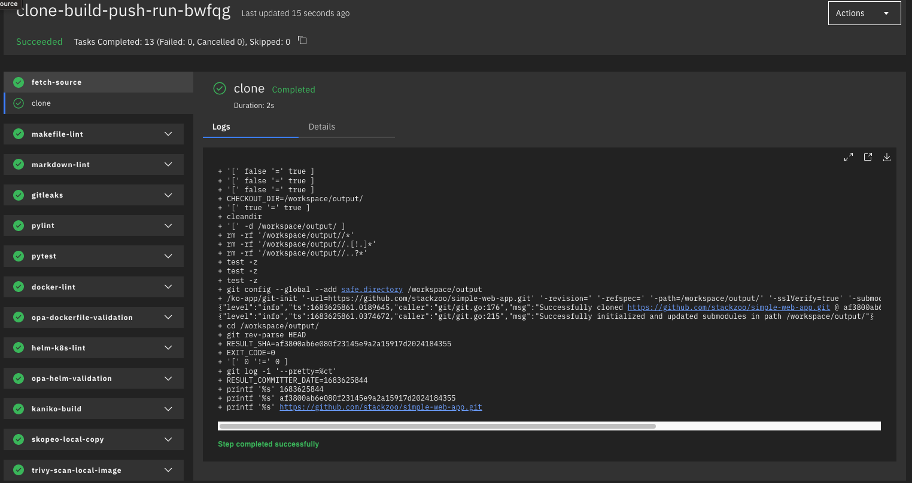
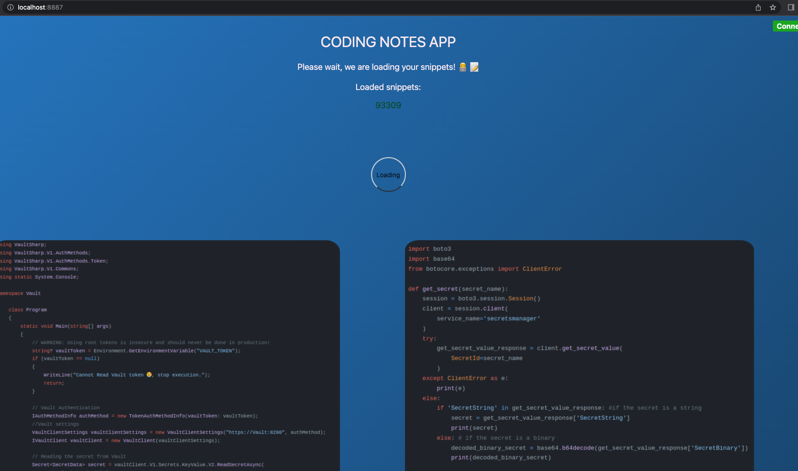
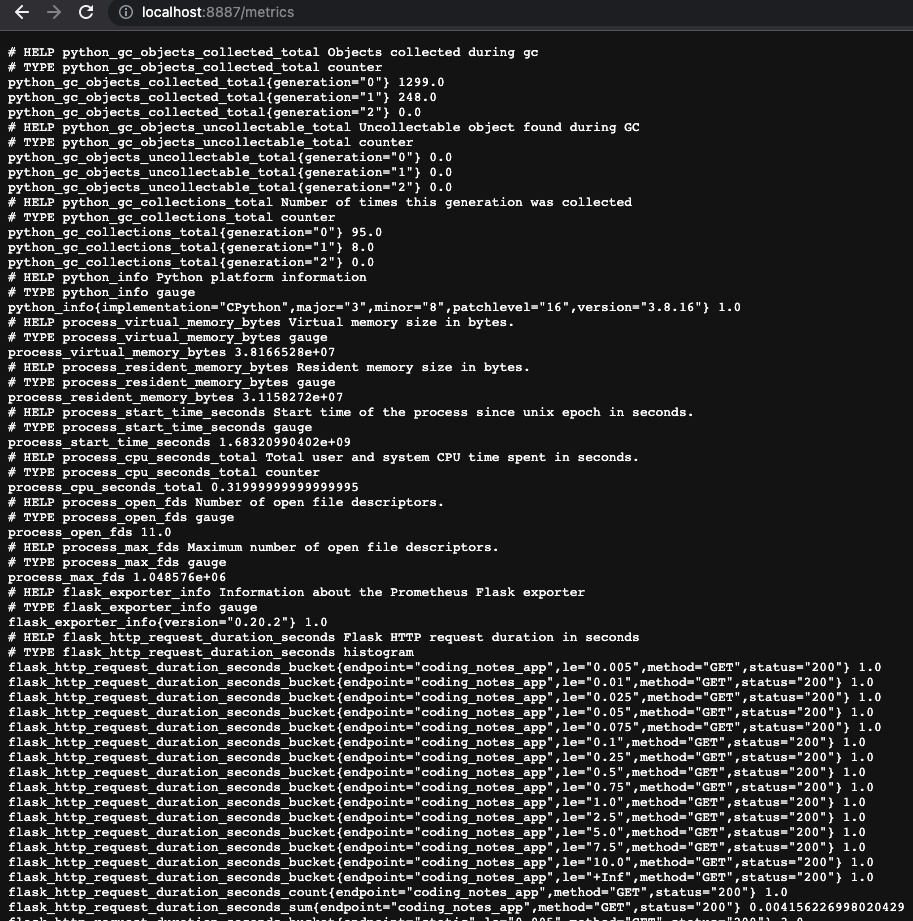

# TEKTON FIRST PIPELINE
This repo contains a working implementation of a [tekton](https://tekton.dev/) pipeline.
<br/>
We implement a tekton pipeline that does the following:
1. *clone* a public git repository
2. does *linting* against the *Makefile*
3. does *linting* against the *README*
4. *SAST* analysis to search for *hardcoded secrets* (api keys, tokens, passwords) in the repository
5. does *linting* against the python code
6. executes a python *unit test*
7. does *linting* and *OPA Conftest* rules checking against the *dockerfile*
8. does *linting* and *OPA Conftest* rules checking against the *helm/k8s manifests*
9.  *build* the *OCI image* and push it to a *local staging docker registry*
10. *scan* the image for vulnerabilities

Some tasks (eg. the linting and testing ones) are run in parallel to speed up the pipeline execution.  
In a real world scenario it is recommended to execute some tasks (eg. SAST, linting) via [pre-commit hooks](https://pre-commit.com/).

**Note**: this repository is intended as a demo on a disposable local development environment, this is not suitable for production.


## Requirements
- Curl
- Make
- Docker
- Minikube
- Helm
- Kubectl
- Tekton CLI
- set up docker [insecure registry](https://docs.docker.com/registry/insecure/) on your dev machine


## Instruction
This repo contains a `Makefile` with all the required commands.

Inspect all *make* targets for instructions:
```console
make help

Usage:
  make <target>
  help             Display this help.
  docker-registry-up  Spin up a local docker registry
  docker-registry-down  Delete the local docker registry
  mini-up          Spin up a dev cluster with Minikube
  mini-dashboard   Enable minikube web dashboard
  mini-down        Delete the Minikube dev cluster
  tkn-install-tasks  Install required tasks from tekton hub
  tekton-run       Run tekton pipeline
  docker-pull-and-run-from-local  Pull the image from local registry and runs it
```

start a local minikube cluster (this will also install Tekton pipelines and dashboard on the cluster):
```console
make mini-up
```

start the local docker registry:
```console
make docker-registry-up
```
if the output of the previous command contains `{"repositories":[]}` you are good to go.

Install required tasks from [tekton hub](https://hub.tekton.dev/):
```console
make tkn-install-tasks
```
Create tekton `pipeline` and `pipelinerun` resources (this will automatically start the pipeline run):
```console
make tkn-run
```

If you want you can inspect the pipeline log from the dashboard, just run:
```console
 kubectl port-forward -n tekton-pipelines service/tekton-dashboard 9097:9097
```
and then open a browser to http://localhost:9097.

After a few minutes, our pipeline has terminated successfully:


We can prove this by pulling the builded image from our local registry and running it locally:
```console
make docker-pull-and-run-from-local
```

Now open the browser at http://localhost:8887 et voilà! 🔥🔥🔥



The app also expose [prometheus](https://prometheus.io/) metrics:  



To clean all the resources simply run:
```console
make mini-down && make docker-registry-down
```
