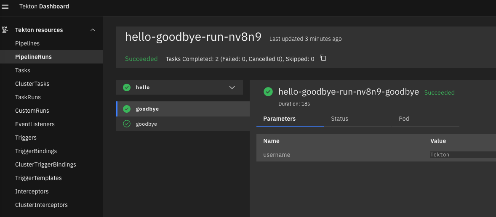

# TEKTON TRIGGERS
This repo contains a working implementation of a `tekton` pipeline that make use of Tekton <a hreff="https://tekton.dev/docs/triggers/">Triggers</a>.

**Note**: this is intended as a local development environment not suitable for production.


## Requirements
- Curl
- Make
- Docker
- Minikube
- Helm
- Kubectl


## Instruction
This repo contains a `Makefile` with all the required commands.

Inspect all *make* targets for instructions:
```console
make help

Usage:
  make <target>
  help             Display this help.
  mini-up          Spin up a dev cluster with Minikube
  mini-dashboard   Enable minikube web dashboard
  mini-down        Delete the Minikube dev cluster
  tkn-run          Apply all needed tekton resources
```

start a local minikube cluster (this will also install Tekton pipelines, triggers and dashboard on the cluster):
```console
make mini-up
```

Apply all tekton resources:
```console
make tkn-run
```

If you want you can inspect the pipeline log from the dashboard, just run:
```console
 kubectl port-forward -n tekton-pipelines service/tekton-dashboard 9097:9097
```
and then open a browser to http://localhost:9097.

Now, enable port-forwarding:
```console
kubectl port-forward service/el-hello-listener 8080
```

Now that the EventListener is running, you can send an event and see what happens.
<br/>
Open a new terminal and submit a payload to the cluster:
```sh
curl -v \
   -H 'content-Type: application/json' \
   -d '{"username": "Tekton"}' \
   http://localhost:8080
```

Output:
```console
*   Trying 127.0.0.1:8080...
* Connected to localhost (127.0.0.1) port 8080 (#0)
> POST / HTTP/1.1
> Host: localhost:8080
> User-Agent: curl/7.87.0
> Accept: */*
> content-Type: application/json
> Content-Length: 22
>
* Mark bundle as not supporting multiuse
< HTTP/1.1 202 Accepted
< Content-Type: application/json
< Date: Fri, 05 May 2023 08:31:00 GMT
< Content-Length: 164
<
{"eventListener":"hello-listener","namespace":"default","eventListenerUID":"63687e8e-90bb-4e0f-9be6-38c817861d80","eventID":"eec8ea94-7ef4-4ccf-86df-45b2b9d5e5ca"}
* Connection #0 to host localhost left intact
```

Also from the dashboard you can see that the pipeline has been triggered and completed successfully:
<p float="left">
  
</p>

You can also see the `PipelineRun` via `kubectl`:
```console
kubectl get pipelineruns -o wide

NAME                      SUCCEEDED   REASON      STARTTIME   COMPLETIONTIME
hello-goodbye-run-nv8n9   True        Succeeded   6m7s        5m26s
```

To clean all the resources simply run:
```console
make mini-down
```
