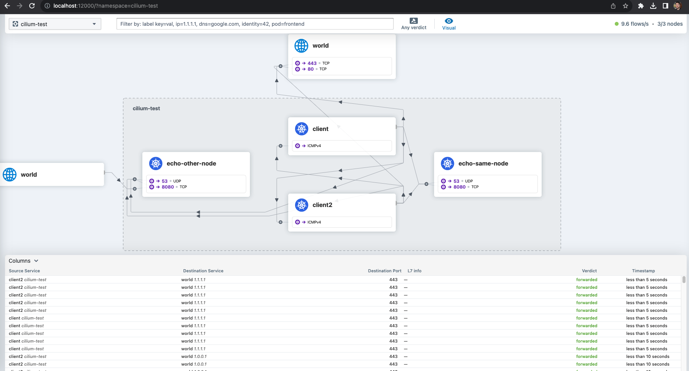

# CILIUM OBSERVABILITY
We'll take a look at Cilium’s CNI chaining mode for observability.  
This repo implements [this](https://isovalent.com/blog/post/cilium-hubble-observability-cni-chaining-mode/) `Cilium` tutorial. 

## Prerequisites
- Docker
- KinD
- Cilium Cli
- Hubble Cli

## Instructions


Create cluster with KinD:  
```console
kind create cluster --config kind-config.yaml
```   

install Cilium using CNI chaining mode:  
```console
cilium install --version 1.14.1 --set cni.chainingTarget=kindnet  --set cni.chainingMode=generic-veth --set routingMode=native --set enableIPv4Masquerade=false --set enableIPv6Masquerade=false
```  

Let's wait for cilium to be up and running:  
```console
cilium status --wait

    /¯¯\
 /¯¯\__/¯¯\    Cilium:             OK
 \__/¯¯\__/    Operator:           OK
 /¯¯\__/¯¯\    Envoy DaemonSet:    disabled (using embedded mode)
 \__/¯¯\__/    Hubble Relay:       disabled
    \__/       ClusterMesh:        disabled

Deployment             cilium-operator    Desired: 1, Ready: 1/1, Available: 1/1
DaemonSet              cilium             Desired: 3, Ready: 3/3, Available: 3/3
Containers:            cilium             Running: 3
                       cilium-operator    Running: 1
Cluster Pods:          1/4 managed by Cilium
Helm chart version:    1.14.1
Image versions         cilium             quay.io/cilium/cilium:v1.14.1@sha256:edc1d05ea1365c4a8f6ac6982247d5c145181704894bb698619c3827b6963a72: 3
                       cilium-operator    quay.io/cilium/operator-generic:v1.14.1@sha256:e061de0a930534c7e3f8feda8330976367971238ccafff42659f104effd4b5f7: 1

```  
Upgrade Cilium and install the Hubble relay:  
```console
cilium upgrade --version 1.14.1 --reuse-values --set hubble.relay.enabled=true --set hubble.ui.enabled=true && cilium status --wait
```   

Port forward the Hubble Relay service in the Kind cluster to our workstation’s host network:  
```console
cilium hubble port-forward &
```  
To access the Hubble UI run the following command:  
```console
cilium hubble ui
```  
Now I can run the Cilium connectivity tests:  
```console
cilium connectivity test
```  

and I can observe all the L3/L4 network flows in the cilium-test namespace with the Hubble CLI tool:  
```console
hubble observe -n cilium-test
```   
Now get a service map view of the namespace using the Hubble UI:  
  

There it is, L3/L4 observability using Hubble without Cilium providing the CNI for this cluster.

## Conclusions
Hopefully this gives you something to consider.  
If you find yourself relying on your existing CNI but needing to take advantage of the eBPF powered capabilities of Cilium and Hubble for observability,  
then Cilium’s CNI chaining mode provides you a method to implement these features without disrupting your existing CNI or workloads.  


