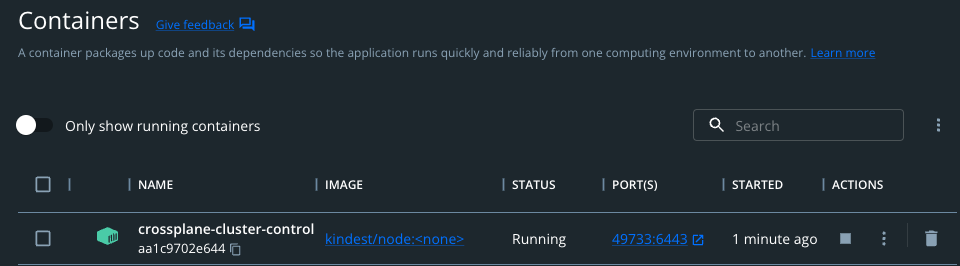
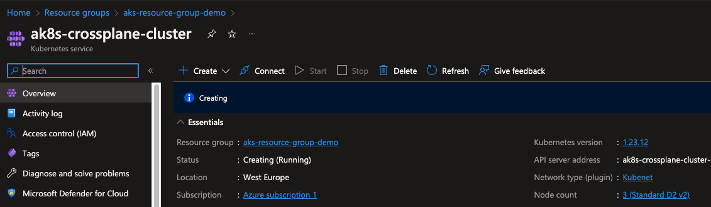

# DEPLOY AKS WITH CROSSPLANE

This repo contains instructions and manifest to deploy an *aks* cluster with <a href="https://www.crossplane.io/">crossplane</a>.

<br/>
<br/>

## Prerequisites
- *azure account*
- *azure-cli*
- *jq*
- *docker*
- *kind*
- *helm*
- *kubectl*

## Instructions
First of all you need to login with the *azure cli*:  
```console
az login
```

<br/>

Now deploy a local Kubernetes cluster with *kind*:  
```console
kind create cluster --config kind-config.yml
```

<br/>

Output:  
```console
Creating cluster "crossplane-cluster" ...
 ✓ Ensuring node image (kindest/node:v1.25.3) 🖼 
 ✓ Preparing nodes 📦  
 ✓ Writing configuration 📜 
 ✓ Starting control-plane 🕹️ 
 ✓ Installing CNI 🔌 
 ✓ Installing StorageClass 💾 
Set kubectl context to "kind-crossplane-cluster"
You can now use your cluster with:

kubectl cluster-info --context kind-crossplane-cluster

Thanks for using kind! 😊
```
<br/>

Now you can see that *kind* has created a docker container for you:  
<div style="width: 65%; height: 65%">

  
  
</div>
<br/>

This will be your local k8s cluster and you are going to install *crossplane* on it.

<br/>

Install crossplane with Helm:  
```console
helm repo add crossplane-stable https://charts.crossplane.io/stable \
&& helm repo update \
&& helm upgrade crossplane --install --create-namespace --namespace crossplane-system crossplane-stable/crossplane
```

<br/>

Output:  
```console
"crossplane-stable" has been added to your repositories
Hang tight while we grab the latest from your chart repositories...
...Successfully got an update from the "falcosecurity" chart repository
...Successfully got an update from the "gatekeeper" chart repository
...Successfully got an update from the "hashicorp" chart repository
...Successfully got an update from the "elastic" chart repository
...Successfully got an update from the "crossplane-stable" chart repository
Update Complete. ⎈Happy Helming!⎈
Release "crossplane" does not exist. Installing it now.
NAME: crossplane
LAST DEPLOYED: Mon Dec 19 09:17:01 2022
NAMESPACE: crossplane-system
STATUS: deployed
REVISION: 1
TEST SUITE: None
NOTES:
Release: crossplane

Chart Name: crossplane
Chart Description: Crossplane is an open source Kubernetes add-on that enables platform teams to assemble infrastructure from multiple vendors, and expose higher level self-service APIs for application teams to consume.
Chart Version: 1.10.1
Chart Application Version: 1.10.1

Kube Version: v1.25.3
```

<br/>

Check crossplane pods (**you need to wait for crossplane pods to be up and running before continuing**):  
```console
❯ k -n crossplane-system get pods
NAME                                       READY   STATUS    RESTARTS   AGE
crossplane-6fd66789b9-zqnm8                1/1     Running   0          2m43s
crossplane-rbac-manager-6f4889484b-7kll9   1/1     Running   0          2m43s
```

<br/>

Install *crossplane cli*:  
```console
curl -sL https://raw.githubusercontent.com/crossplane/crossplane/master/install.sh | sh \
&& sudo mv kubectl-crossplane /opt/homebrew/bin \
&& kubectl crossplane --help
```
<br/>

Output:  
```console
kubectl plugin downloaded successfully! Run the following commands to finish installing it:

sudo mv kubectl-crossplane /opt/homebrew/bin
kubectl crossplane --help

Visit https://crossplane.io to get started. 🚀
Have a nice day! 👋

Usage: kubectl crossplane <command>

A command line tool for interacting with Crossplane.

Flags:
  -h, --help       Show context-sensitive help.
  -v, --version    Print version and quit.
      --verbose    Print verbose logging statements.

Commands:
  build configuration
    Build a Configuration package.

  build provider
    Build a Provider package.

  install configuration <package> [<name>]
    Install a Configuration package.

  install provider <package> [<name>]
    Install a Provider package.

  update configuration <name> <tag>
    Update a Configuration package.

  update provider <name> <tag>
    Update a Provider package.

  push configuration <tag>
    Push a Configuration package.

  push provider <tag>
    Push a Provider package.

Run "kubectl crossplane <command> --help" for more information on a command.
```
<br/>

In order to deploy resources on *azure* we need the specific crossplane provider.
<br/>
In order to configure it, follow the official docs <a href="https://docs.crossplane.io/v1.10/cloud-providers/azure/azure-provider/">here</a>.

<br/>

This repo contain a script to do this automatically, launch the script:  

```console
chmod +x  configure-azure-provider.sh && ./configure-azure-provider.sh
```

<br/>

Wait for the script execution to finish and then deploy your own AKS cluster!  
```console
k apply -f aks-cluster.yml
```

<br/>

Output:  
```console
resourcegroup.azure.crossplane.io/aks-resource-group-demo created
akscluster.compute.azure.crossplane.io/ak8s-crossplane-cluster created
```

<br/>

You can inspect your cluster on your azure web console:  
<div style="width: 65%; height: 65%">

  
  
</div>
<br/>

As the last thing, we need to obtain the `kubeconfig` file, we can do this via `azure-cli`:  
```console
az aks get-credentials --resource-group aks-resource-group-demo --name ak8s-crossplane-cluster \
&& k get nodes
```

Output:  
```console
Merged "ak8s-crossplane-cluster" as current context in /Users/simone.ragonesi/.kube/config
NAME                       STATUS   ROLES   AGE     VERSION
aks-agentpool-13582638-0   Ready    agent   7m53s   v1.23.12
aks-agentpool-13582638-1   Ready    agent   7m40s   v1.23.12
aks-agentpool-13582638-2   Ready    agent   7m55s   v1.23.12
```

<br/>

You can delete the created resources with the `kubectl delete <resource-type> <resource-name>` command.
<br/>

For example, if you want to delete the created aks cluster, you can run:  
```console
kubectl delete akscluster ak8s-crossplane-cluster

kscluster.compute.azure.crossplane.io "ak8s-crossplane-cluster" deleted
```  
This will remove the resource from crossplane and also from your cloud provider.


