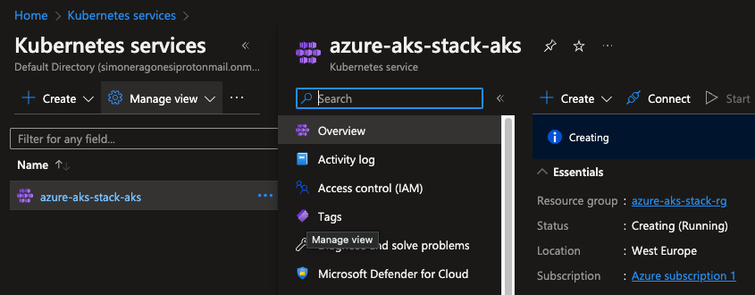
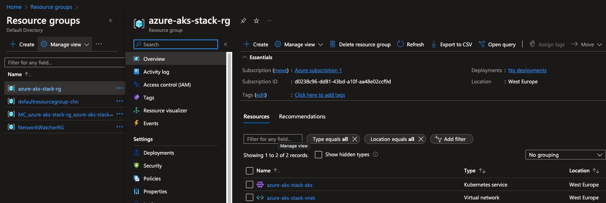

# AKS COMPOSITION PoC

AKS Crossplane composition proof of concept.


## Abstract
The goal of this repo is to deploy the same resources as in the <a href="https://github.com/R3DRUN3/cloud-native/tree/main/projects/infrastructure/crossplane-aks">parent</a> repo but using Crossplane `Compositions` instead of simple `managed resources`.

## Requirements
- *azure account*
- *azure-cli*
- *jq*
- *docker*
- *kind*
- *kubectl*

## Instructions
To install `upbound cli` run this install script:  
```console
curl -sL https://cli.upbound.io | sh
```

See [up docs](https://docs.upbound.io/cli/) for more install options.
<br/>

For installing the platform we need a running Crossplane control plane. We are
using [Universal Crossplane (UXP)
](https://github.com/upbound/universal-crossplane). Ensure that your kubectl
context is pointing to the correct Kubernetes cluster or for example create a
[kind](https://kind.sigs.k8s.io) cluster:

```console
kind create cluster
```

Finally install UXP into the `upbound-system` namespace:

```console
up uxp install
```

You can validate the install by inspecting all installed components:

```console
kubectl get all -n upbound-system
```

<br/>


Now configure *azure provider* and *helm provider*:  
```console
chmod +x providers/configure-azure-provider.sh && sh providers/configure-azure-provider.sh
```

<br/>

Apply all compositions:  
```console
kubectl apply -f package --recursive 
```

<br/>


Now go ahead and create a custom defined cluster:  
```console
kubectl apply -f examples/cluster-claim.yaml
```

<br/>

Check for managed resources:  
```console
❯ kubectl get managed

NAME                                                READY   SYNCED   EXTERNAL-NAME        AGE
resourcegroup.azure.upbound.io/azure-aks-stack-rg   True    True     azure-aks-stack-rg   6m8s

NAME                                               CHART   VERSION   SYNCED   READY   STATE   REVISION   DESCRIPTION   AGE
release.helm.crossplane.io/azure-aks-stack-vault   vault   0.22.1    False                                             6m8s

NAME                                                                      READY   SYNCED   EXTERNAL-NAME         AGE
kubernetescluster.containerservice.azure.upbound.io/azure-aks-stack-aks   True    True     azure-aks-stack-aks   6m8s

NAME                                                           READY   SYNCED   EXTERNAL-NAME          AGE
virtualnetwork.network.azure.upbound.io/azure-aks-stack-vnet   True    True     azure-aks-stack-vnet   6m8s

NAME                                                 READY   SYNCED   EXTERNAL-NAME        AGE
subnet.network.azure.upbound.io/azure-aks-stack-sn   True    True     azure-aks-stack-sn   6m8s
```

<br/>

You can inspect your cluster on your azure web console:  
<div style="width: 65%; height: 65%">

  
  
</div>
<br/>

And inside the created resource group we can see our Vnet and our cluster:  
<div style="width: 65%; height: 65%">

  
  
</div>
<br/>


Now we can export our aks kubeconfig:  
```console
az aks get-credentials --resource-group azure-aks-stack-rg --name azure-aks-stack-aks --file kubeconfig-aks
```

<br/>

And change kubectl context:  
```console
export KUBECONFIG=kubeconfig-aks
```

<br/>

Now you can inspect your aks cluster with kubectl, for example:  
```console
echo "\n\nRetrieving cluster nodes:" \
&& kubectl get nodes \
&& echo "\n\nRetrieving cluster namespaces:" \
&& kubectl get namespaces \
&& echo "\n\nRetrieving pods in the 'vault' namespace:" \
&& kubectl get pods -n vault
```

<br/>

Output:  
```console
Retrieving cluster nodes:
NAME                              STATUS   ROLES   AGE   VERSION
aks-default-39530864-vmss000000   Ready    agent   76m   v1.24.3
aks-default-39530864-vmss000001   Ready    agent   76m   v1.24.3
aks-default-39530864-vmss000002   Ready    agent   76m   v1.24.3


Retrieving cluster namespaces:
NAME              STATUS   AGE
default           Active   78m
kube-node-lease   Active   78m
kube-public       Active   78m
kube-system       Active   78m
vault             Active   74m


Retrieving pods in the 'vault' namespace:
NAME                                                  READY   STATUS    RESTARTS   AGE
azure-aks-stack-vault-0                               0/1     Running   0          24m
azure-aks-stack-vault-agent-injector-68797cf5-9kw68   1/1     Running   0          24m
```

<br/>

To delete all created resources run the following command:  
```console
kubectl delete -f examples/cluster-claim.yaml
```

<br/>


