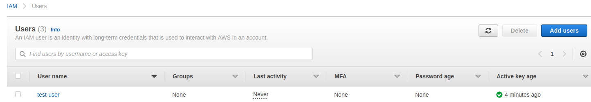
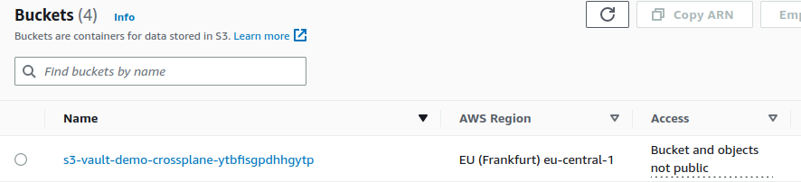

# CROSSPLANE DEMO

<br/>
<div style="width: 65%; height: 65%">

  
</div>
<br/>

Learn how to use `crossplane` to manage your cloud-native infrastructure.
<br/>
<br/>

## Abstract
`Crossplane` is a software that allows you to build and manage your cloud-native infrastructure.
<br/>

Crossplane runs on `Kubernetes` and expand it's functionalities to also include the management of
<br/>
cloud resources external to the cluster.
<br/>
<br/>
You can learn more about it via the <a href="">official</a> git repo and from the <a href="https://docs.crossplane.io/v1.10/">docs</a>.

<br/>

While different, `Crossplane` is often compared with `Terraform` and rightly so.
<br/>
Terraform has some shortcomings (given by its monolithic approach) when it comes to multiple teams managing the same environment.
<br/>
There are some ways to get around those limitation (see for example <a href="https://github.com/R3DRUN3/terraform-best-practices">this</a> repo) but they introduce new ones:
<br/>
eg. one team need to wait for the terraform state to be unlocked if another team is working on it.
<br/>
<br/>
Crossplane, under many point of views, is superior to Terraform and allows you to manage your
<br/>
cloud environments in a more automated way (*GitOps*) and to prevent <a href="https://www.digitalocean.com/community/tutorials/what-is-immutable-infrastructure">configuration drifts</a>.


This repo will teach you to do the following things:  
- deploy `crossplane` on a `Kubernetes` cluster.
- deploy `hashicorp vault` on the same cluster.
- integrate `crossplane` with `hashicorp vault` for secrets management.
- create `aws` resources from `crossplane`.

<br/>

[If you want to know more about *vault* and its kubernetes integration I highly recommend taking a look at <a href="https://github.com/R3DRUN3/cyberhall/tree/main/k8s-security/k8s-vault">this</a> repo]

<br/>
<br/>

## Prerequisites
This demo has been tested on `Ubuntu 22.04.1 LTS x86_64`
<br/>

In order to follow, you need the following things:
- an `aws` account.
- `aws cli`
- `docker`
- `minikube`
- `kubectl`
- `helm`

<br/>
<br/>

## Instructions

First of all we need to start our local *Kubernetes* playground, we will use *minikube* for that.
<br/>
Start the cluster:  
```console
minikube start
```

<br/>

Output sample:  
```console
😄  minikube v1.26.0 on Ubuntu 22.04
✨  Automatically selected the docker driver. Other choices: virtualbox, none, ssh, qemu2 (experimental)
📌  Using Docker driver with root privileges
👍  Starting control plane node minikube in cluster minikube
🚜  Pulling base image ...
🎉  minikube 1.28.0 is available! Download it: https://github.com/kubernetes/minikube/releases/tag/v1.28.0
💡  To disable this notice, run: 'minikube config set WantUpdateNotification false'

❗  minikube was unable to download gcr.io/k8s-minikube/kicbase:v0.0.32, but successfully downloaded gcr.io/k8s-minikube/kicbase:v0.0.32 as a fallback image
🔥  Creating docker container (CPUs=2, Memory=7900MB) ...
❗  This container is having trouble accessing https://k8s.gcr.io
💡  To pull new external images, you may need to configure a proxy: https://minikube.sigs.k8s.io/docs/reference/networking/proxy/
🐳  Preparing Kubernetes v1.24.1 on Docker 20.10.17 ...
    ▪ Generating certificates and keys ...
    ▪ Booting up control plane ...
    ▪ Configuring RBAC rules ...
🔎  Verifying Kubernetes components...
    ▪ Using image gcr.io/k8s-minikube/storage-provisioner:v5
🌟  Enabled addons: storage-provisioner, default-storageclass
🏄  Done! kubectl is now configured to use "minikube" cluster and "default" namespace by default
```

<br/>

Now install crossplane with the following command:  
```console
kubectl create namespace crossplane-system \
&& helm repo add crossplane-stable https://charts.crossplane.io/stable \
&& helm repo update \
&& helm install crossplane --namespace crossplane-system crossplane-stable/crossplane
```
<br/>

Output:  
```console
namespace/crossplane-system created
"crossplane-stable" already exists with the same configuration, skipping
Hang tight while we grab the latest from your chart repositories...
...Successfully got an update from the "hashicorp" chart repository
...Successfully got an update from the "falcosecurity" chart repository
...Successfully got an update from the "crossplane-stable" chart repository
...Successfully got an update from the "openfaas" chart repository
Update Complete. ⎈Happy Helming!⎈
NAME: crossplane
LAST DEPLOYED: Sat Dec 10 14:57:53 2022
NAMESPACE: crossplane-system
STATUS: deployed
REVISION: 1
TEST SUITE: None
NOTES:
Release: crossplane

Chart Name: crossplane
Chart Description: Crossplane is an open source Kubernetes add-on that enables platform teams to assemble infrastructure from multiple vendors, and expose higher level self-service APIs for application teams to consume.
Chart Version: 1.10.1
Chart Application Version: 1.10.1

Kube Version: v1.24.1
```

<br/>

Next we will install *vault* helm chart:  
```console
helm repo add hashicorp https://helm.releases.hashicorp.com \
&& helm install vault hashicorp/vault
```

<br/>

Output:  
```console
"hashicorp" already exists with the same configuration, skipping
NAME: vault
LAST DEPLOYED: Sat Dec 10 15:00:16 2022
NAMESPACE: default
STATUS: deployed
REVISION: 1
NOTES:
Thank you for installing HashiCorp Vault!

Now that you have deployed Vault, you should look over the docs on using
Vault with Kubernetes available here:

https://www.vaultproject.io/docs/


Your release is named vault. To learn more about the release, try:

  $ helm status vault
  $ helm get manifest vault
```

<br/>

Let's check the created crossplane and vault pods:  
```console
echo "" && echo "crossplane has these pods" && kubectl get pods -n crossplane-system \
&& echo "" \
&& echo "vault has these pods" && kubectl get pods -n default
```
<br/>

Output:  
```console
crossplane has these pods
NAME                                       READY   STATUS    RESTARTS   AGE
crossplane-7d4bbdd8dd-6g9gv                1/1     Running   0          6m19s
crossplane-rbac-manager-7f9b4f6d47-rwqtv   1/1     Running   0          6m19s

vault has these pods
NAME                                   READY   STATUS    RESTARTS   AGE
vault-0                                0/1     Running   0          3m56s
vault-agent-injector-8b6fd97b8-5j9ht   1/1     Running   0          3m56s
```

<br/>

Note that the `vault-0` pod is not ready because we need to unseal it first.
In order to unseal it, wait until both vault pods are in `running` state and then run the following command:  
```console
kubectl exec vault-0 -- vault operator init -key-shares=1 -key-threshold=1 -format=json > cluster-keys.json \
&& VAULT_UNSEAL_KEY=$(cat cluster-keys.json | jq -r ".unseal_keys_b64[]") \
&& kubectl exec vault-0 -- vault operator unseal $VAULT_UNSEAL_KEY
```

<br/>

Output:  
```console
Key             Value
---             -----
Seal Type       shamir
Initialized     true
Sealed          false
Total Shares    1
Threshold       1
Version         1.12.1
Build Date      2022-10-27T12:32:05Z
Storage Type    file
Cluster Name    vault-cluster-0afc3ffd
Cluster ID      dfde1944-c886-7b6b-285c-6f2febeb4520
HA Enabled      false
```

<br/>

Congratulations! You have unsealed your vault!
<br/>
In order for Vault to be able to authenticate requests based on Kubernetes service accounts, the Kubernetes authentication backend must be enabled.
Show vault root token with this command:  
```console
cat cluster-keys.json | jq -r ".root_token"
```

<br/>
Copy the displayed token.
<br/>

Open a shell on the `vault-0` pod:  
```console
kubectl exec -it vault-0 -- /bin/sh
```

<br/>

login to vault with the token:  
```console
vault login
```

<br/>

Output:  
```console
Success! You are now authenticated. The token information displayed below
is already stored in the token helper. You do NOT need to run "vault login"
again. Future Vault requests will automatically use this token.

Key                  Value
---                  -----
token                <will show your root token here>
token_accessor       jcYbkMmxos2U4E5gYBMsjmY6
token_duration       ∞
token_renewable      false
token_policies       ["root"]
identity_policies    []
policies             ["root"]
```

<br/>

Enable kubernetes authentication:  
```console
vault auth enable kubernetes \
&& vault write auth/kubernetes/config \
        token_reviewer_jwt="$(cat /var/run/secrets/kubernetes.io/serviceaccount/token)" \
        kubernetes_host="https://$KUBERNETES_PORT_443_TCP_ADDR:443" \
        kubernetes_ca_cert=@/var/run/secrets/kubernetes.io/serviceaccount/ca.crt
```

<br/>

Output:  
```console
Success! Enabled kubernetes auth method at: kubernetes/
Success! Data written to: auth/kubernetes/config
```

<br/>
Ok, now we can exit from the container shell:  
```console
exit
```

<br/>

Next we need to create an aws IAM user for this demo, in order to do this we will use *aws cli*.
Tu do this, launch the bash script:  
```console
chmod +x aws-iam-user.sh && ./aws-iam-user.sh
```

<br/>

NOTE: In case of problems with the script, open it with a text editor and execute the commands one by one.
<br/>

You can see the newly created user from your aws IAM console:  
<div style="width: 65%; height: 65%">

  
</div>
<br/>
Now we need to store this user credentials in vault.
<br/>
First we need to enable the vault secret engine :
```console
kubectl exec -it vault-0 -- env \
  ACCESS_KEY_ID=${ACCESS_KEY_ID} \
  AWS_SECRET_ACCESS_KEY=${AWS_SECRET_ACCESS_KEY} \
  /bin/sh
```
<br/>

Next enable secret engine and push the aws secrets to vault path:  
```console
vault secrets enable -path=secret kv-v2 \
&& vault kv put secret/data/provider-creds/aws-default access_key="$ACCESS_KEY_ID" secret_key="$AWS_SECRET_ACCESS_KEY"
```

<br/>

Output:  
```console
=============== Secret Path ===============
secret/data/data/provider-creds/aws-default

======= Metadata =======
Key                Value
---                -----
created_time       2022-12-10T15:02:27.846319731Z
custom_metadata    <nil>
deletion_time      n/a
destroyed          false
version            1
```

<br/>

While inside the container, create a vault policy for reading provider credentials:  
```console
vault policy write provider-creds - <<EOF
path "secret/data/provider-creds/*" {
    capabilities = ["read", "list"]
}
EOF
```

<br/>

And then create a role for crossplane provider pods:  
```console
vault write auth/kubernetes/role/crossplane-providers \
        bound_service_account_names="*" \
        bound_service_account_namespaces=crossplane-system \
        policies=provider-creds \
        ttl=24h
```

<br/>

Now you can exit from the pod with the usual `exit` command.

<br/>

Install the crossplane aws provider (with custom controller config for vault secrets injection):  
```console
kubectl apply -f aws-provider.yml
``` 

<br/>

Now apply the provider configuration:  
```console
kubectl apply -f aws-config.yml
```

<br/>

Finally we can deploy a resource on aws, in our case it will be an S3 bucket.
<br/>
Simply run this command:  
```console
kubectl apply -f s3-bucket.yml
```

<br/>

After some time you can see your fresh new bucket on aws!
<div style="width: 65%; height: 65%">

  
</div>
<br/>


