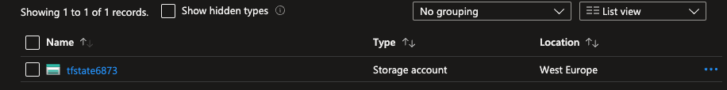
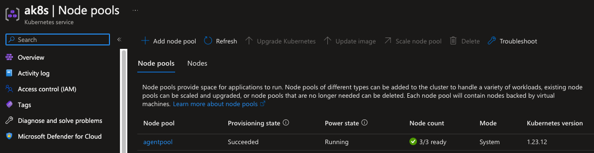

# AZURE KUBERNETES SERVICE
Spin up an `aks` cluster with *Terraform*.

<br/>

## Prerequisites
- an *azure* account
- `azure-cli`
- `terraform`


<br/>

## Instructions
login to azure via `azure-cli` and save your *SUBSCRIPTION_ID* (the *id* field in the json output):  
```cosnole
az login
```

<br/>

Now set the *SUBSCRIPTION_ID* in azure-cli:  
```cosnole
az account set --subscription="SUBSCRIPTION_ID"
```

<br/>

We can now create a Service Principal which will have permissions to manage resources in the specified subscription using the following command:  

```cosnole
az ad sp create-for-rbac --role="Contributor" --scopes="/subscriptions/SUBSCRIPTION_ID
```

<br/>

Output example:  
```cosnole
"Creating a role assignment under the scope of "/subscriptions/xxxxxxxxxx-xxxx-xxxx-xxxx-xxxxxxxxxxxx"
{
  "appId": "xxxxxxxxxx-xxxx-xxxx-xxxx-xxxxxxxxxxxx",
  "displayName": "azure-cli-2022-16-12-16-16-09",
  "password": "xxxxxxxx-xxxx-xxxx-xxxx-xxxxxxxxxxxx",
  "tenant": "xxxxxxxx-xxxx-xxxx-xxxx-xxxxxxxxxxxx"
}
```

<br/>

Now login with the created service principal:  
```console
az login --service-principal -u appId -p password --tenant tenant
```

<br/>

One of terraform best practice is to configure a central storage to store and lock the
<br/>
Terraform state when someone is applying terraform scripts against a piece of infrastructure.
<br/>
In order to do that you can follow the official <a href="https://learn.microsoft.com/en-us/azure/developer/terraform/store-state-in-azure-storage?tabs=azure-cli">docs</a> .

<br/>
I really recommend reading the documentation but, in this folder, there is a script that will do the storage account creation for you.
<br/>

Just run the following command:  
```console
chmod +x storage_account.sh && ./storage_account.sh
```
<br/>

You can see your new storage account under your resource group on azure:  
<div style="width: 65%; height: 65%">

  
</div>
<br/>


Now that we have our storage account configured, we can launch terraform!
<br/>

Before launching it we need to create a file called `Variables.tf` with the following structure and add our azure keys:  
```hcl
variable "subscription_id" {
  default = "your-subscription-id-here"
}

variable "tenant_id" {
  default = "your-tenant-id-here"
}


variable "client_id" {
  default = "your-client-id-here"
}

variable "client_secret" {
  default = "your-client-secret-here"
}

variable "resource_group_name" {
  default = "ak8s-test-resource-group"
}

variable "agent_count" {
  default = 3  # number of worker nodes
}

variable "dns_prefix" {
  default = "ak8s"
}

variable "cluster_name" {
  default = "ak8s"
}

variable "location" {
  default = "westeurope" # or other locations
}
```

<br/>

Now take a look at all the resources that will be created:  
```console
terraform init && terraform plan
```

<br/>

Once you have inspected the plan and you are satisfied with it, launch it!  
```console
terraform apply
```
<br/>

The whole procedure takes about 3 minutes.
<br/>

Once finished, we can retrieve the `kubeconfig`:  
```console
echo "$(terraform output -raw kube_config)" > ~/.kube/config
```

<br/>

Now we can use kubectl to communicate with our cluster!
<br/>

List the nodes:   
```console
k get nodes

NAME                                STATUS   ROLES   AGE   VERSION
aks-agentpool-38963533-vmss000000   Ready    agent   1m   v1.23.12
aks-agentpool-38963533-vmss000001   Ready    agent   1m   v1.23.12
aks-agentpool-38963533-vmss000002   Ready    agent   1m   v1.23.12
```
<br/>

You can also see your cluster from azure web console:  
<br/>
<div style="width: 65%; height: 65%">

  
</div>
<br/>


<br/>

If you want to destroy all created resources, simply run:  
```console
terraform destroy
```